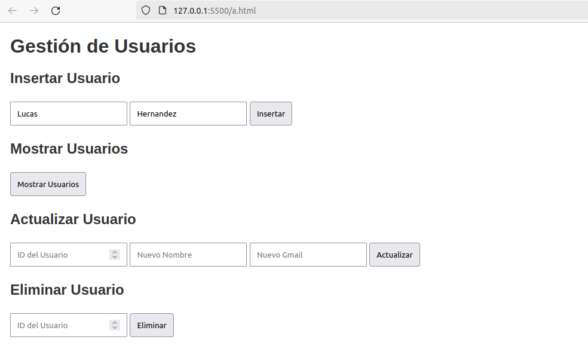

## Primero creamos el formulario en Html para poder introducir y localizar datos desde aquí.

```html
<html lang="es">
<head>
    <meta charset="UTF-8">
    <meta name="viewport" content="width=device-width, initial-scale=1.0">
    <title>Gestión de Usuarios</title>
    <style>
        body { font-family: Arial, sans-serif; margin: 20px; }
        h1, h2 { color: #333; }
        form { margin-bottom: 20px; }
        input, button { margin: 5px 0; padding: 10px; }
        button { cursor: pointer; }
    </style>
</head>
<body>
    <h1>Gestión de Usuarios</h1>

    <h2>Insertar Usuario</h2>
    <form method="post">
        <input type="text" name="nombre" placeholder="Nombre" required>
        <input type="email" name="gmail" placeholder="Gmail" required>
        <button type="submit" name="insert">Insertar</button>
    </form>

    <h2>Mostrar Usuarios</h2>
    <form method="post">
        <button type="submit" name="select">Mostrar Usuarios</button>
    </form>

    <h2>Actualizar Usuario</h2>
    <form method="post">
        <input type="number" name="id" placeholder="ID del Usuario" required>
        <input type="text" name="nuevo_nombre" placeholder="Nuevo Nombre" required>
        <input type="email" name="nuevo_gmail" placeholder="Nuevo Gmail" required>
        <button type="submit" name="update">Actualizar</button>
    </form>

    <h2>Eliminar Usuario</h2>
    <form method="post">
        <input type="number" name="id" placeholder="ID del Usuario" required>
        <button type="submit" name="delete">Eliminar</button>
    </form>
</body>
</html>
```

## Creamos una función para poder crear usuarios desde nuestro index.

```php
function insertUser($nombre) {
    $conn = dbConnect();
    $stmt = $conn->prepare("INSERT INTO users (nombre) VALUES (?)");
    if ($stmt) {
    
        $stmt->bind_param("s", $nombre);
        if ($stmt->execute()) {
            echo "Registro insertado correctamente.<br>";
        } else {
            echo "Error al insertar: " . $stmt->error . "<br>";
        }
        $stmt->close();
    } else {
        echo "Error al preparar la consulta: " . $conn->error . "<br>";
    }
    $conn->close();
}
```

## Lo siguiente será una función para poder visualizar los usuarios.

```php
function selectUsers() {
    $conn = dbConnect();
    $select = "SELECT * FROM users";
    
    if ($result = $conn->query($select)) {
        if ($result->num_rows > 0) {
            while ($row = $result->fetch_assoc()) {
                echo "ID: " . htmlspecialchars($row['id']) . " - Nombre: " . htmlspecialchars($row['nombre']) . "<br>";
            }
        } else {
            echo "No se encontraron registros.<br>";
        }
        $result->free(); // Liberar el conjunto de resultados
    } else {
        echo "Error en la consulta: " . $conn->error . "<br>";
    }

    $conn->close();
}
```

## Ahora creamos un script de PHP que sirva para modificar los usuarios ya creados.

```php
function updateUser($id, $nuevoNombre) {
    $conn = dbConnect();
    $update = "UPDATE users SET nombre = ? WHERE id = ?";

    if ($stmt = $conn->prepare($update)) {
        $stmt->bind_param("si", $nuevoNombre, $id);
        
        if ($stmt->execute()) {
            echo "Registro actualizado correctamente.<br>";
        } else {
            echo "Error al actualizar: " . $stmt->error . "<br>";
        }

        $stmt->close();
    } else {
        echo "Error al preparar la consulta: " . $conn->error . "<br>";
    }

    $conn->close();
}
```

## Por último programamos un código que permita eliminar usuarios.

```php
function deleteUser($id) {
    $conn = dbConnect();
    $delete = "DELETE FROM users WHERE id = ?";

    if ($stmt = $conn->prepare($delete)) {
        $stmt->bind_param("i", $id);

        if ($stmt->execute()) {
            echo "Registro eliminado correctamente.<br>";
        } else {
            echo "Error al eliminar: " . $stmt->error . "<br>";
        }

        $stmt->close();
    } else {
        echo "Error al preparar la consulta: " . $conn->error . "<br>";
    }

    $conn->close();
}
```

## Quedará así, con nuestro menu desplegado:


