# Trabajando con Git y Markdown 3

## Creamos un repositorio de trabajo
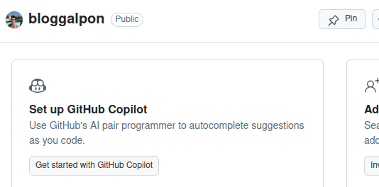

## Inicializamos el repositorio
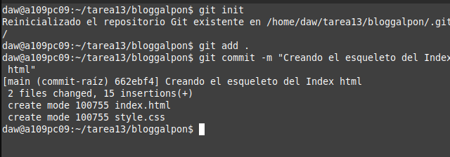

## Creamos la estructura básica de la web
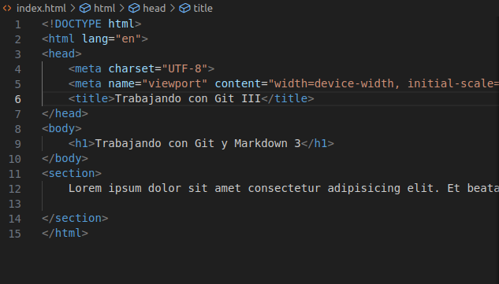

## Añadimos un archivos style.css
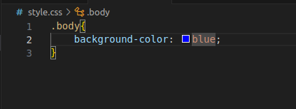

## Añadimos un logo
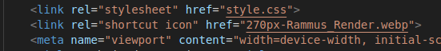

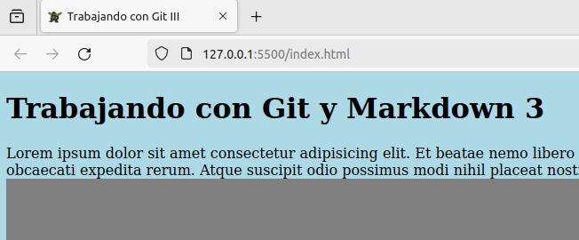

## Añadimos CSS para varios elementos de la página

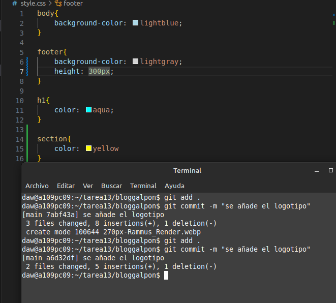

## Creamos una ramma desarrollo y reubicamos los archivos

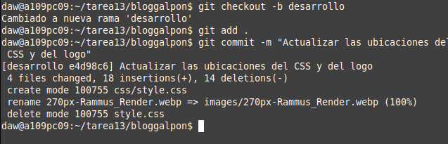

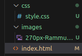

## Creamos una rama bugfix

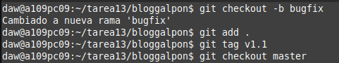

## Creamos nuevas etiquetas y borramos bugfix, dluego llevamos los cambios a la rama Main

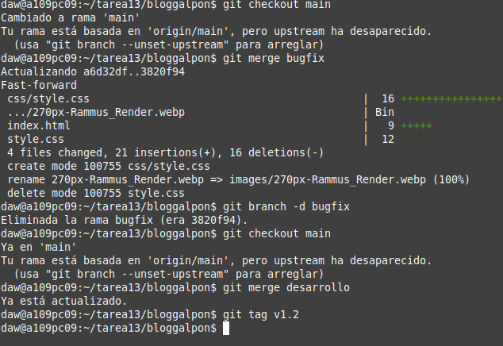

## Comprobación final

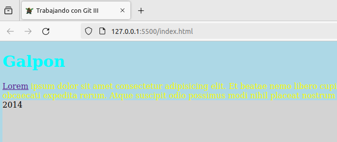
