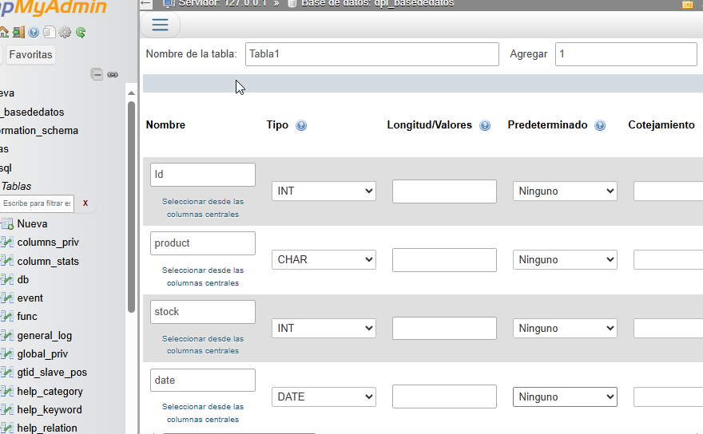
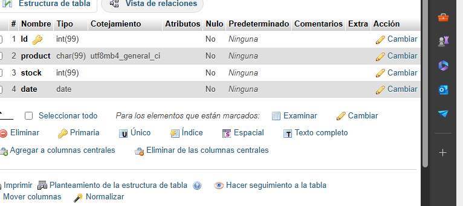
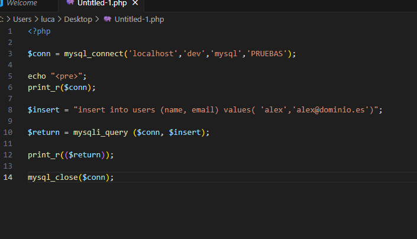

##Crear usuarios con PHP
###Pasos:

Creamos la base de datos:

Creamos las tablas de la base de datos:

Comprobamos que todo se ha creado correctamente:

Creamos un codigo php para inyectar en la base de datos un nuevo usuario

Por último comprobamos que todo se creo correctamente

