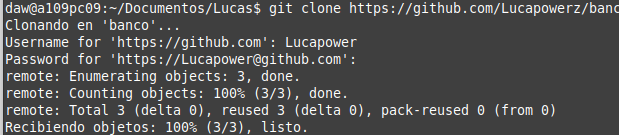

# Trabajando con el Visual Studio y Git Hub
## Pasos
1. Creamos una cuenta en GitHub
2. Creamos un repositorio llamado "banco" para trabajar
   
4. Clonamos el repositorio "banco" con "git clone" con la ruta al repositorio https://github.com/LucaPowerz/banco
   
5. Ponemos el contenido en el repositorio clonado y lo añadimos todo con "git add ."
6. Ahora en otra carpeta creamos un proyecto llamado "banco"
7. Guardamos todo con un git commit -m "TareaVisualGitHub"
    
8. Y con git push añadimos el contenido que hemos estado copiando
9. Ahora borramos la carpeta clonada
10. Ahora volvemos a clonar el repositorio con "git clone" con la misma ruta que cogimos antes
    
11. Gracias a estos comandos ya tenemos el repositorio con todos los cambios.
12. Por ultimo hacemos un cambio en la carpeta y lo subimos nuevamente con los comandos que previamente usamos: git add . , git coomit -m "tarea", git push.
   
