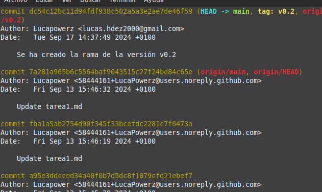

Primero creamos la rama y nos posicionamos en ella:
    
    Git Checkout -b v0.2

Ahora creamos un nuevo fichero, aprovechamos para entrar en el y poner algún texto:

    touch 2.txt

Ahora confirmamos los cambios de forma remota:

    git add.
    git commit -m "Creamos una rama para la v0.2"
    git push --set-upstream origin v0.2

Hacemos un merge:

    git checkout main
    git merge v0.2

Ahora vamos a provocar un conflicto con Merge:

    Escribimos texto en 1.txt rama main.
    Escribimos lo mismo que escribimos antes en 1.txt pero esta vez en la rama v0.2.
    Hacemos commit en las dos.
    Y por ultimo hacemos un merge hacia main.

Por último listamos la ramas:

    git branch --no-merged Sería la v0.2
    git branch --merged Sería la main

Ahora hacemos un git log para verificar que todo ha ocurrido como queriamos:

