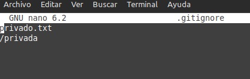

Clonar repositorio en local:
git clone https://github.com/LucaPowerz/DPL_A_Lucas.git

Creamos un documento tarea1_1.md.
nano tarea1_1.md y lo añadimos con git add

Crear un primer commit:
git commit -m "Commit Inicial"

Subir cambios a repositorio remoto:
git push origin main

Ahora creamos un archivo .gitignore:
Nano .gitignore, y escribimos dentro de el dos lineas incluyendo en la primera el documento "privado.txt" y en la segunda la carpeta "/privada"

Añadimos el fichero 1.txt:
Git add 1.txt

Creamos la etiqueta v0.1:
Git tag v0.1

Subimos todo:
Hacemos primero un git upull y luego
Git push origin

Repositorios de compañeros:
| Nombre | Repositorio |
| ------------- | ------------- |
| Isaias  | [Enlace a Github 1](https://github.com/IsaiasTolP/DPL_A_Isaias)  |
| German  | [Enlace a Github 2](https://github.com/GermanOjeda/DPL_A_German)   |
| Rafael | [Enlace a Github 3](https://github.com/RafaelMayor)   |
